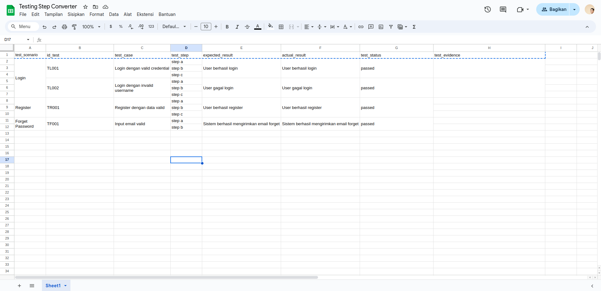

## Converter Google Sheet to Allure JSON Format

This tool functionality is to convert the data from Google Spreadsheet to Allure JSON format using AppScript extension from Google Spreadsheet. The only thing you need to do is to create table with header format as this:

`| test_scenario |	id_test	test_case |	test_step |	expected_result |	actual_result |	test_status	test_evidence |`
 
User only need to add the test as they do as image below:
 

 
After user already input all the test. They can run the script on AppScript then the `.json` file will generated in drive folder